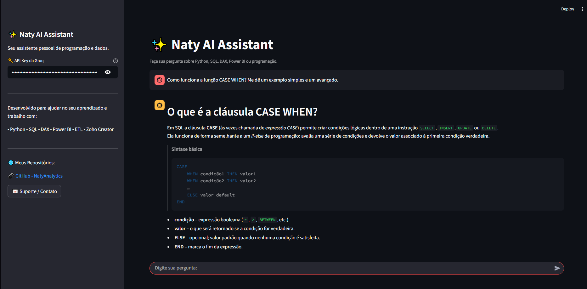

# ✨ Naty AI Assistant

Um assistente inteligente desenvolvido com **Python + Streamlit + Groq API** para responder perguntas sobre:


<table align="center" cellspacing="0" cellpadding="0" style="background:white; padding:5px;">
  <tr>
    <td>
      
    </td>
  </tr>
</table>


- 🐍 Python  
- 🛢️ SQL  
- 📊 DAX / Power BI  
- ⚙️ ETL  
- 🧠 Lógica de Programação  
- 🧩 Zoho Creator (Deluge)  
- 📈 Engenharia e Análise de Dados  

O objetivo do projeto é criar um **assistente pessoal de estudos e trabalho**, capaz de auxiliar profissionais e estudantes na área de dados com explicações claras, exemplos práticos e código gerado sob demanda.

---

## 🚀 Tecnologias Utilizadas

- **Python 3.13**
- **Streamlit**
- **Groq API (modelo openai/gpt-oss-20b)**
- **Conda (Ambiente Virtual)**

---

## 📦 Instalação e Execução com Anaconda

Siga os passos abaixo para rodar o projeto no seu computador:

---

### **1️⃣ Crie o ambiente virtual com Conda**

```bash
conda create --name natyai python=3.13

```

2️⃣ Ative o ambiente
```
No Windows:
conda activate natyai
```


3️⃣ Instale o pip (caso necessário)
```
conda install pip
```

4️⃣ Instale as dependências
```

Certifique-se de estar na pasta do projeto onde existe o arquivo requirements.txt.

pip install -r requirements.txt
```

5️⃣ Execute o aplicativo
```
streamlit run naty_ai_assistant.py
```


O Streamlit abrirá no navegador automaticamente (ou você pode acessar manualmente):

http://localhost:8501

## 🔑 Configuração da API (Groq)

Para o assistente funcionar, você precisa inserir sua API Key da Groq na barra lateral do aplicativo.

Crie sua chave aqui:

## 👉 https://console.groq.com/keys

---
## 🌟 Funcionalidades

Chat interativo com histórico

Explicações claras e didáticas

Exemplos de código (Python, DAX, SQL etc.)

Suporte a fluxos completos de dados

Interface moderna em Streamlit

100% personalizável

## 🗂 Estrutura do Projeto
```
📁 ESTUDOCASO1
│── naty_ai_assistant.py     # Arquivo principal do Streamlit
│── requirements.txt         # Dependências do projeto
│── README.md                # Documentação
```


## 📌 Observações

Este projeto é para fins de estudo e demonstração.

A IA pode gerar respostas incorretas — revise antes de usar em produção.

Sinta-se livre para ajustar, melhorar ou expandir o assistente!